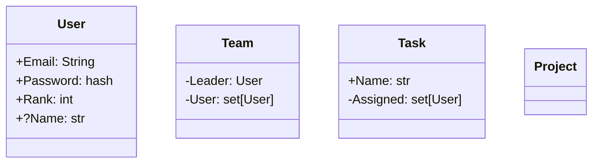

## User

- Email: str
- Password: hash
- Rank: int
- ?Name: str

## Team

- Leader: User
- Users: set[User]

## Task

- Assigned: set[User | Team]

## Project

- Deadline: Datetime
- Tasks: list[Task]
- Assigned: set[User | Team]

## Topic

- Name: str

## Post

