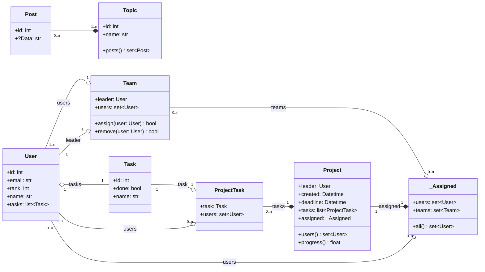
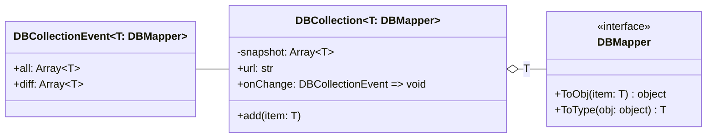
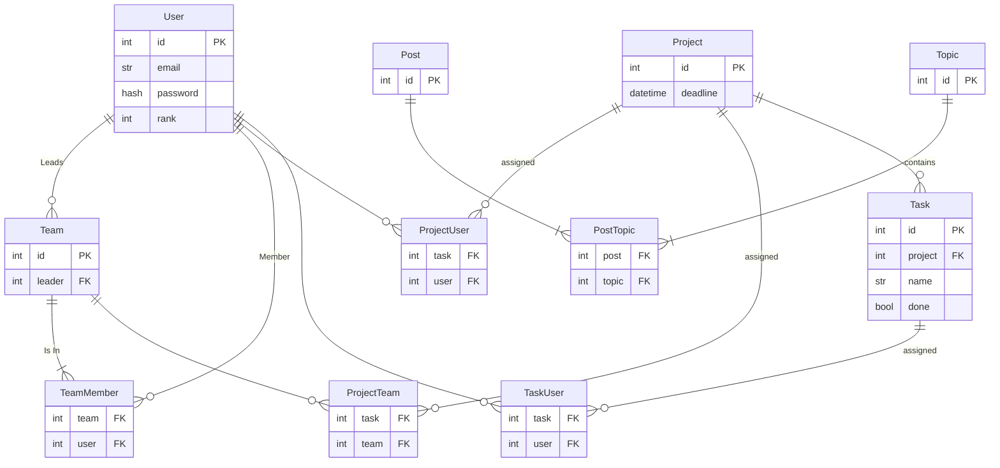

# Frontend Class Diagram

# Backend Database Diagram

## Decisions

- The usage of ID's will allow for the display name to be changed without breaking all references.

# To Be Decided
## Post

The data of a post depends on how we do it. If it's a wiki then we need nothing more than the link to data resource (html).
We could also include some meta data to allow for searching such as title and stuff. Depending on how dynamic these pages are, author as well. If it's a forum we will do some sort of linked list of a comment thread or something.
