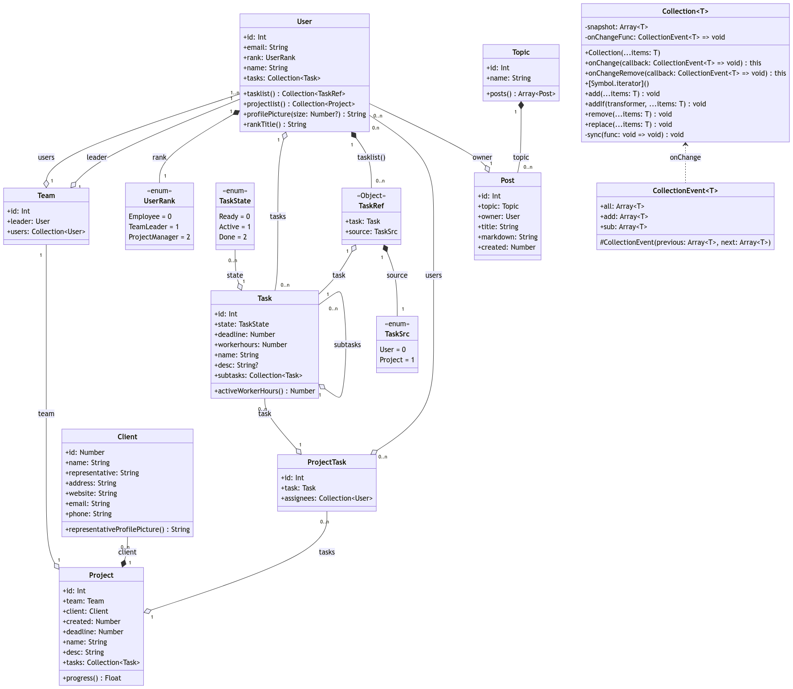
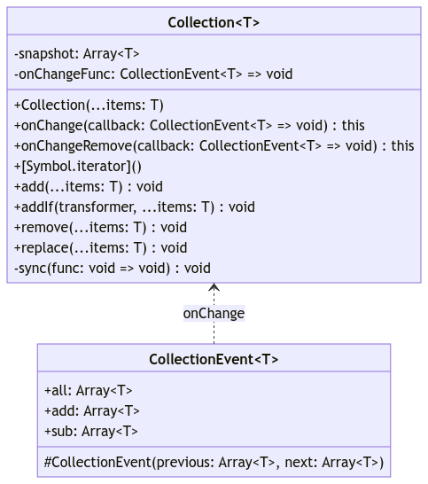

<!-- to compile: pandoc report.md -o report.pdf -->

# Contributions

Below you can find every member's contribution to Part 1 of this module's coursework.

## Arshad Chati

- System Design
  - Login/Registration
    - Created Login and Registration designs on Figma as a basis for the rest of the team to begin implementing front-end elements.
  - Productivity Management Sub-system
    - Created designs for the productivity management sub-system including different views based on user rank, taking into consideration all features and functionalities and ensuring designs are available for them.
    - Designed all 'dashboards' and the kanban board used across the site which served as a starting point for further design by other team members during implementation.
  - Knowledge Management Sub-system
    - Designed the knowledge management sub-system with separate designs for the search page, results page, post page, edit post page and more.
  - Mobile Views
    - Designed basic mobile views as a template for the team to implement mobile first development to produce a more responsive site.
- Re-design based on client communications
  - Responsible for taking client feedback and re-working existing designs to meet their needs or replacing some designs entirely with new ones.
- Part One Presentation
  - Joint responsibility in creating the prototype presentation for the client.
  - Ensuring all relevant information is included, working on timing and ensuring information is kept concise yet informative.

## Calin Corcimaru

- Requirements document
  - Gathered and documented the project's requirements from the specification letter and subsequent communications with Client representatives.
  - Delivered constant updates to the requirements document for maintaining current and adding new requirements.
- Project page
  - Developed the Project page and its elements that dynamically displays information based on the Project id.
  - Implemented functionality that allows Managers to assign tasks to users when creating a new task.
  - Developed a filter that allowed the system to display tasks on the page based on User's rank.
- Client page
  - Modeled the Client page that dynamically displays all the client information based on the Client id.
- Communications with Client
  - Clarified requirements by sending messages and reminders to the Client.
  - Drafted some of the emails and messages that were then sent to the Client.
- Leadership
  - Coordinated the team (planning, task allocation, decision making, etc) during meetings and other channels of communications (WhatsApp, etc).
  - Ensured the team is on track with task progression and deadlines.
- Report
  - Handled the writing, editing and publishing of the report.

\pagebreak

## Jack Humphrey

- Communication with clients
  - Completed the majority of communication with the clients. This involved drafting questions, sending questions and updating our own document with our questions and the clients responses.
- User view page
  - Responsible for creating the user view page. This is a page for users to see information about other users in the system.
- User edit page
  - Responsible for creating the user edit page. This is a page for users to edit their own account information (such as password).
- Login page draft
  - Created an initial draft of the login page which was then reworked by Rowan.

## Adam Hutton

- Created the Dashboard/Task view
  - Including the 'Kanban' section reused elsewhere.
- Created the Manager's Dashboard
- Developed ways of displaying progress to the user, including the horizontal progress bar, and the 'spinner' one used in the project page
- Created the navigation, reworked it to work on mobile
- Created the base css used everywhere in the project
  - Including the card and title styles, navigation and ensuring that the designs are consistent and responsive throughout the website.
- Contributed to the requirements document, helping to reword/rewrite requirements to aid in conciseness and reduce ambiguity

## Rowan Murphy

- Built and developed Login and registration pages
  - Created the front of the registration page from scratch and expanded on Jacks' initial draft of the login page.
- Search and parts of search results page
  - Created the search page elements to be used over a number of pages.
  - Used these elements to make the pages responsive and easy to use. Positioned them accordingly to aid in design and the flow of the pages.
- Checked through code and caught bugs and features that people missed
  - Proof reading code and caught some issues such as a button missing function.
  - Also discovered bugs with certain elements of data usage etc.
- Partook in decisions regarding the project and creation of requirements
  - Assisted in creating the initial requirements draft to give a basis of what the project aimed to do.
  - Provided opinions and feedback to make the best decisions when designing, creating and building the project as well as suggesting changes etc. to offer alternative solutions and a different approach to problems in development where there were multiple viable answers.

\pagebreak

## Thomas Woolhouse

- Designing Class Diagrams
  - Modelled the system as a diagram.
  - Modelled the system in JavaScript classes.
- Designed and Created the API (Application Programming Interface)
  - Created a consistent API to be reused throughout the project and make webpage elements reactive.
  - Implemented a schemeless database.
  - Curated a custom serialistion system to allow for content parity between individual webpages.
- Login
  - Developed functionality that enables the user to login and will stay logged in for the duration of the session.
  - Additionally implemented the function to havethe user log outfrom anywhere within the system.
  - Also added functionality to keep track of the current logged-in user.
- Posts
  - Implemented all pages related to creating, viewing, editing.
  - Integrated an external API into the system to convert between Markdown and HTML.
  - Introduced the ability to search through posts in the system based on a search query as well as filter them by topics.
  - Added functionality to create a new topic.
- Dashboard & Kanban
  - Ensuring the kanban on the dashboard and the project page are consistent.
  - Coded the system for dividing a task into multiple subtasks.
  - Integrated functionality allowing users to be assigned to task.
  - Designed and created the ability to display an employees current workload on both the manager and project page.
- Other Contributions
  - Developed the code and interactivity to create clients within the system.
  - Contributed to teamates knowledge of both CSS and JavaScript, leading them to progress throughout more of the projectand supporting them in that.

# Requirements

Requirements are taken from the client specification letter unless stated otherwise by a footnote.

<!-- FOOT NOTE NUMBERS HERE DO NOT MATCH THE ONES IN THE EXPORTED PDF -->

## 1. Log in / Registration requirements.

1. A user **must** be able to login to the system using their work email and password.
2. The email address used for logging in **must** be using the `@make-it-all.co.uk` domain.
3. A user **must** be registered in order to log in to the system.

## 2. Registration Page Requirements & Registration Requirements.

1. The system **must** allow existing users to invite new users to register to the system using their work email.
2. A member of staff **must** be able to register only one account in the system.
3. The email address used for registering **must** be using the `@make-it-all.co.uk` domain.
4. The password used for registering **must** be at least 12 characters long and contain a combination of at least one uppercase letter, one lowercase letter, a number, and a special character (!@#$%^&\*).\footnote{04/11/2022 \url{https://learn.lboro.ac.uk/mod/forum/discuss.php?d=358985}}
5. A confirmation email **could** be sent out to the email address used for registration to check for a valid email.\footnote{ 04/11/2022 \url{https://learn.lboro.ac.uk/mod/forum/discuss.php?d=358983\#p554513}}

## 3. User requirements

1. The system **must** allow a user to have at least one of the following roles: Employee, Team leader or Project Manager.
2. The system **must** allow a user to have different permissions dependant on their currently assigned role.\footnote{04/11/2022 \url{https://learn.lboro.ac.uk/mod/forum/discuss.php?d=355151\#p554145}\label{footnote 6}}
3. A user **must** be able to be assigned to a project.\footnote{22/10/2022 \url{https://learn.lboro.ac.uk/mod/forum/discuss.php?d=355047}\label{footnote 3}}
4. A user **must** be able to work on any number of projects.\footnote{22/10/2022 \url{https://learn.lboro.ac.uk/mod/forum/discuss.php?d=355049}\label{footnote 4}}
5. A user **must** be able to create a private task for their private to-do list.\footnote{22/10/2022 \url{https://learn.lboro.ac.uk/mod/forum/discuss.php?d=355053\#p549541}\label{footnote 5}}
<!-- 6. A user **should** be able to be part of multiple teams. -->

## 4. Team leader requirements

1. A team **must** have a team leader.
2. The system **must** allow any user to be a team leader.\footref{footnote 6}
3. The system **must** allow a user to be a team leader for multiple projects.\footref{footnote 6}
4. A team leader **must** be able to manage the members of their team (add, remove).\footref{footnote 6}
5. A team leader **must** be able to assign tasks to users in their team.\footnote{22/10/2022 \url{https://learn.lboro.ac.uk/mod/forum/discuss.php?d=355075\#p549565}\label{footnote 7}}
6. A team leader **must** be able to create tasks for a project they supervise.\footref{footnote 6}
7. A team leader **must** be able to track task progress of a project.

## 5. Project Manager requirements

1. A project manager **must** be able to manage all the projects in the system.\footref{footnote 6}
2. A project manager **must** be able to add tasks to any current project.\footref{footnote 6}
3. A project manager **must** be able to assign users to project tasks.\footref{footnote 6}
4. A project manager **must** be able to create a new project.\footref{footnote 6}
5. A project manager **must** be able to assign users to a team.\footref{footnote 6}

## 6. Productivity Management requirements

1. A user **must** have access to their private to-do list, which is a user's personal to-do list containing tasks that are not related to any Projects.\footref{footnote 5}
2. A user **must** have access to their personal dashboard, which will contain task they are assigned to from Projects they are working on and their own private todo list.
3. The board **must** have columns in the 'Kanban' view that tasks can be placed in.\footnote{14/10/2022 \url{https://learn.lboro.ac.uk/mod/forum/discuss.php?d=356809}\label{footnote 8}}
4. The system **should** allow users to switch between a Kanban and 'to-do list' view.\footref{footnote 8}

## 7. Task requirements

1. A task **must** have a name that will be displayed.
2. A task **should** have a description.
3. A task **must** have a date for a deadline.\footnote{22/10/2022 \url{https://learn.lboro.ac.uk/mod/forum/discuss.php?d=355045\#p549487}\label{footnote 9}}
4. A task **must** have an estimated number of worker-hours needed to complete the task.\footref{footnote 10}
5. A task **should** have the option of being divided into smaller sub-tasks. A sub-task is a task, that the parent tasks depends on.\footnote{22/10/2022 \url{https://learn.lboro.ac.uk/mod/forum/discuss.php?d=355051\#p549539}\label{footnote 10}}
6. If a task has sub-tasks, then its worker-hours **should** be calculated as a sum of the worker-hours of the smaller tasks.\footref{footnote 10}
7. A task **must** be able to display the current state it is in. (To-Do, In Progress, Complete).\footref{footnote 10}
8. A task with subtasks **should** display the percentage of sub-tasks that are completed.\footref{footnote 10}
9. A task **should** be able to be categorized as either a Project-specific (select which Project) or private task (not related to any project).\footref{footnote 5}
10. The system **should** allow a Project Manager/Team leader to modify and re-assign a Task.\footnote{04/11/2022 \url{https://learn.lboro.ac.uk/mod/forum/discuss.php?d=359721\#p554115}\label{footnote 24}}
11. The system **could** allow a Sub-Task to be divided into multiple Sub-Tasks.\footref{footnote 10}

## 8. Project requirements

1.  A Project **must** have a title.\footnote{22/10/2022 \url{https://learn.lboro.ac.uk/mod/forum/discuss.php?d=355047\#p549501}\label{footnote 11}}
2.  A Project **should** have a description.
3.  A Project **must** have a date for a deadline.\footnote{22/10/2022 \url{https://learn.lboro.ac.uk/mod/forum/discuss.php?d=355067\#p549557}\label{footnote 12}}
4.  A Project **must** have a progress displayed, which is measured by the percentage of tasks completed.\footnote{22/10/2022 \url{https://learn.lboro.ac.uk/mod/forum/discuss.php?d=355063\#p549553}\label{footnote 13}}
5.  A Project **must** have a client.\footref{footnote 11}
6.  A Project **must** have a team assigned to it.\footref{footnote 3}
7.  The system **should** allow a user to view the team members of their Project.
8.  The system **should** allow a user to view their assigned tasks if they are part of a Project.
9.  The system **must** allow a Project to be created by a Manager.\footref{footnote 6}

## 9. Project Manager

1. The project manager **should** be able to access and manage any Project details from their dashboard.\footnote{13/10/2022 \url{https://learn.lboro.ac.uk/mod/forum/discuss.php?d=355039\#p546189}\label{footnote 14}}
2. The system **should** allow a project manager to manage teams and users that are assigned to any Project.\footnote{22/10/2022 \url{https://learn.lboro.ac.uk/mod/forum/discuss.php?d=355151\#p549485}\label{footnote 15}}

\pagebreak

## 10. Manager dashboard requirements

1.  The manager dashboard **should** allow a team leader or project manager be able to see how many tasks and total worker-hours a user currently has assigned.
2.  The manager dashboard **should** display a warning to a Project Manager/Team Leader if a user's assigned effort load exceeds 37.5 worker hours per week.\footref{footnote 16}
3.  The Project tasks **could** be able to be filtered based on Project or team member assigned to it.
4.  A Project **should** display whether it is sufficiently resourced. This is determined based on the sum of worker-hours required by its tasks, the number of workers assigned (and their daily work capacity) and the Project's deadline.\footnote{04/11/2022 \url{https://learn.lboro.ac.uk/mod/forum/discuss.php?d=355067\#p554135}\label{footnote 16}}
5.  The manager dashboard **could** display a warning to a Project Manager/Team Leader if the project is expected to fall behind the deadline, based on worker hours.
6.  A manager/team leader **could** be warned that a employee needs training if they are behind a deadline or having trouble working on a specific task.\footnote{22/10/2022 \url{https://learn.lboro.ac.uk/mod/forum/discuss.php?d=355071\#p549561}\label{footnote 17}}

## 11. Knowledge Management requirements

1. The system **must** allow a user to create a new post.
2. The knowledge management subsystem **must** have a search functionality where a User can search Posts by specific Topics.\footnote{24/10/2022 \url{https://learn.lboro.ac.uk/mod/forum/discuss.php?d=357789\#p550055}\label{footnote 18}}
3. Posts **must** be viewable by all users by default.\footnote{22/10/2022 \url{https://learn.lboro.ac.uk/mod/forum/discuss.php?d=355057\#p549547}\label{footnote 19}}
4. The system **could** allow to change the permissions of accessing specific Posts only by an employee with certain permissions.\label{footnote 19}}
5. Posts **must** only be able to be edited by a Manager or the User who has created it.\footnote{22/10/2022 \url{https://learn.lboro.ac.uk/mod/forum/discuss.php?d=355055\#p549545}\label{footnote 20}}
6. The subsystem **could** contain a FAQ page.\footref{footnote 18}
7. The subsystem **should** offer users a way to contact author of post for specific questions.\footref{footnote 18}
8. A Post **must** only have 1 topic assigned to it.\footnote{22/10/2022 \url{https://learn.lboro.ac.uk/mod/forum/discuss.php?d=355043\#p549491}\label{footnote 21}}
9. The system **must** allow a Topic have multiple Posts.\footref{footnote 21}

## 12. Client requirements

1. A Client **must** have key information including Company name, Client Representative, Office Address, and Contact Information.\footnote{24/10/2022 \url{https://learn.lboro.ac.uk/mod/forum/discuss.php?d=355047\#p550039}\label{footnote 22}}
2. The system **must** allow a new Client to be added.

## 13. System Requirements

1. The system **must** have a responsive design that will cater for different platforms and screen sizes.\footnote{11/10/2022 \url{https://learn.lboro.ac.uk/mod/forum/discuss.php?d=355077\#p545293}\label{footnote 23}}
2. The system **must** be able to be accessed 24 hours a day.
3. A user **should** be directed to the employee dashboard after logging in.
4. The system **could** be accessed via a dedicated web address.
5. The system **must** follow the GDPR regulations.

# Class diagrams of the System

\

<!-- \pagebreak

{height=25% width=90%} -->

<!-- [^1]: 04/11/2022 <https://learn.lboro.ac.uk/mod/forum/discuss.php?d=358985> -->

<!-- [^2]: 04/11/2022 <https://learn.lboro.ac.uk/mod/forum/discuss.php?d=358983#p554513> -->

<!-- [^3]: 22/10/2022 https://learn.lboro.ac.uk/mod/forum/discuss.php?d=355047 -->

<!-- [^4]: 22/10/2022 <https://learn.lboro.ac.uk/mod/forum/discuss.php?d=355049> -->

<!-- [^5]: 22/10/2022 <https://learn.lboro.ac.uk/mod/forum/discuss.php?d=355053#p549541> -->

<!-- [^6]: 04/11/2022 <https://learn.lboro.ac.uk/mod/forum/discuss.php?d=355151#p554145> -->

<!-- [^7]: 22/10/2022 <https://learn.lboro.ac.uk/mod/forum/discuss.php?d=355075#p549565> -->

<!-- [^8]: 14/10/2022 <https://learn.lboro.ac.uk/mod/forum/discuss.php?d=356809> -->

<!-- [^9]: 22/10/2022 <https://learn.lboro.ac.uk/mod/forum/discuss.php?d=355045#p549487> -->

<!-- [^10]: 22/10/2022 <https://learn.lboro.ac.uk/mod/forum/discuss.php?d=355051#p549539> -->

<!-- [^11]: 22/10/2022 <https://learn.lboro.ac.uk/mod/forum/discuss.php?d=355047#p549501> -->

<!-- [^12]: 22/10/2022 <https://learn.lboro.ac.uk/mod/forum/discuss.php?d=355067#p549557> -->

<!-- [^13]: 22/10/2022 <https://learn.lboro.ac.uk/mod/forum/discuss.php?d=355063#p549553> -->

<!-- [^14]: 13/10/2022 <https://learn.lboro.ac.uk/mod/forum/discuss.php?d=355039#p546189> -->

<!-- [^15]: 22/10/2022 <https://learn.lboro.ac.uk/mod/forum/discuss.php?d=355151#p549485> -->

<!-- [^16]: 04/11/2022 <https://learn.lboro.ac.uk/mod/forum/discuss.php?d=355067#p554135> -->

<!-- [^17]: 22/10/2022 <https://learn.lboro.ac.uk/mod/forum/discuss.php?d=355071#p549561> -->

<!-- [^18]: 24/10/2022 <https://learn.lboro.ac.uk/mod/forum/discuss.php?d=357789#p550055> -->

<!-- [^19]: 22/10/2022 <https://learn.lboro.ac.uk/mod/forum/discuss.php?d=355057#p549547> -->

<!-- [^20]: 22/10/2022 <https://learn.lboro.ac.uk/mod/forum/discuss.php?d=355055#p549545> -->

<!-- [^21]: 22/10/2022 <https://learn.lboro.ac.uk/mod/forum/discuss.php?d=355043#p549491> -->

<!-- [^22]: 24/10/2022 <https://learn.lboro.ac.uk/mod/forum/discuss.php?d=355047#p550039> -->

<!-- [^23]: 11/10/2022 <https://learn.lboro.ac.uk/mod/forum/discuss.php?d=355077#p545293> -->

<!-- [^24]: 04/11/2022 <https://learn.lboro.ac.uk/mod/forum/discuss.php?d=359721#p554115> -->
